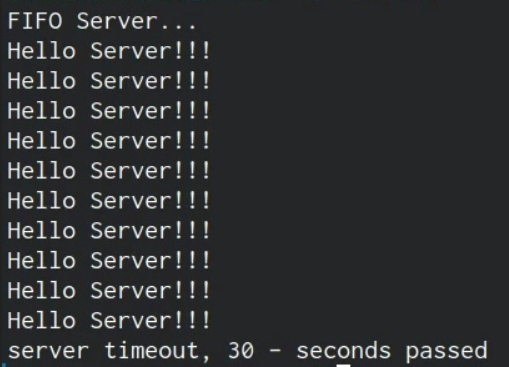
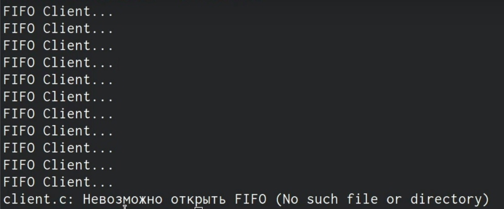

# Отчёт по лабораторной работе №15
## Именованные каналы

---

## Цель выполнения лабораторной работы

Приобретение практических навыков работы с именованными каналами.

---

## Задачи выполнения лабораторной работы

1. Ознакомиться с теоретическим материалом.

2. Выполнить упражнения.

3. Ответить на контрольные вопросы.

---

## Изучите приведённые в тексте программы server.c и client.c.

>     int
>     main()
>     {
>     int readfd; /* дескриптор для чтения из FIFO */
>     int n;
>     char buff[MAX_BUFF]; /* буфер для чтения данных из FIFO */
>     /* баннер */
>     printf("FIFO Server...\n");
>     if(mknod(FIFO_NAME, S_IFIFO | 0666, 0) < 0)
>     {
>     fprintf(stderr, "%s: Невозможно создать FIFO (%s)\n",
>     __FILE__, strerror(errno));
>     exit(-1);
>     }

---

* Сперва создаю файлы, с которыми буду работать, среди коотрых так же исходный файл из методичики для примера.
* Заполняю файл common.h
* Заполняю файл server.c
* Заполняю файл client2.c
* Создаю makefile и заполняю его
* Использую команду make 
* Запускаю процесс

---

---

---

## Вывод

В ходе выполнения поставленных задач я приобрел простейшие навыки работы с именованными каналами.

---

# ***Спасибо за внимание!***
## ʕ ᵔᴥᵔ ʔ

